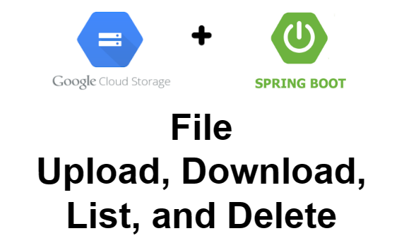
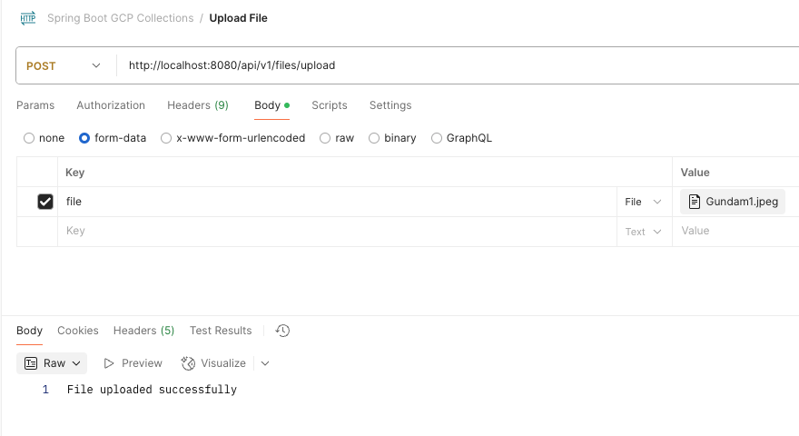
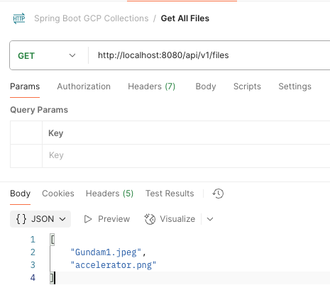
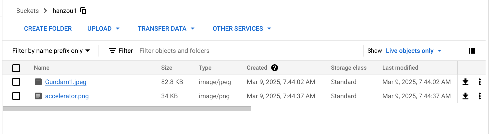

# spring-boot-gcp-cloud-storage-sample

### Things to do list:

1. Clone this repository: `git clone https://github.com/hendisantika/spring-boot-gcp-cloud-storage-sample.git`
2. Go to the folder: `cd spring-boot-gcp-cloud-storage-sample`
3. Setup your GCP Cloud Storage Bucket
4. Change the `application.properties` file
5. Run the application: `mvn clean spring-boot:run`
6. Open your favorite browser: http://localhost:8080
7. Upload your file
8. Check your GCP Cloud Storage Bucket
9. Or you can use Postman to upload the file
10. Import your Postman Collection: `spring-boot-gcp-cloud-storage-sample.postman_collection.json`

### Image Screenshot

Upload File

Download File

http://localhost:8080/api/v1/files/download?fileName=accelerator.png

List All Files

GCP Cloud Storage Bucket

